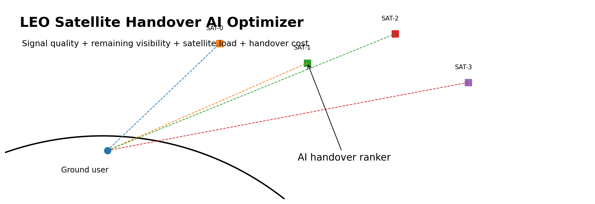
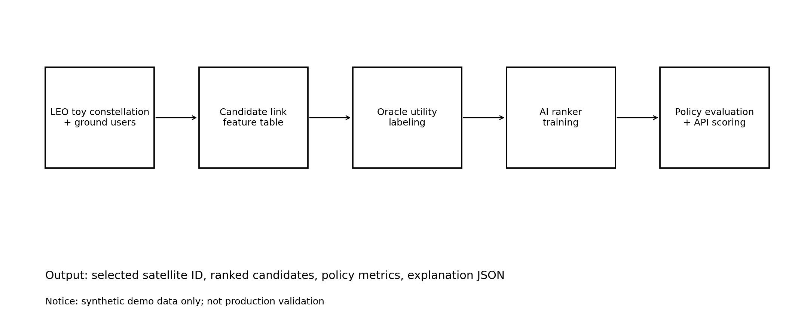
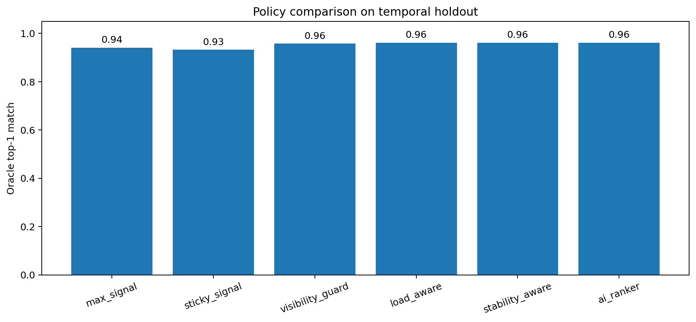
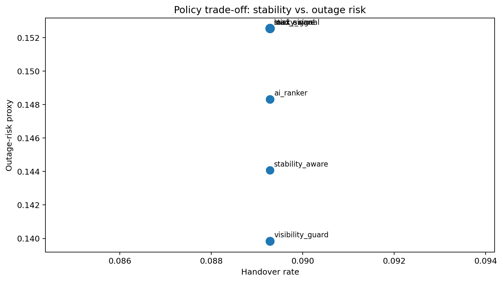
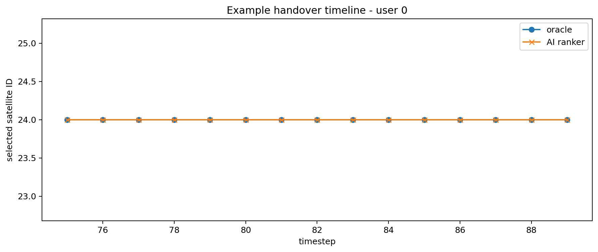
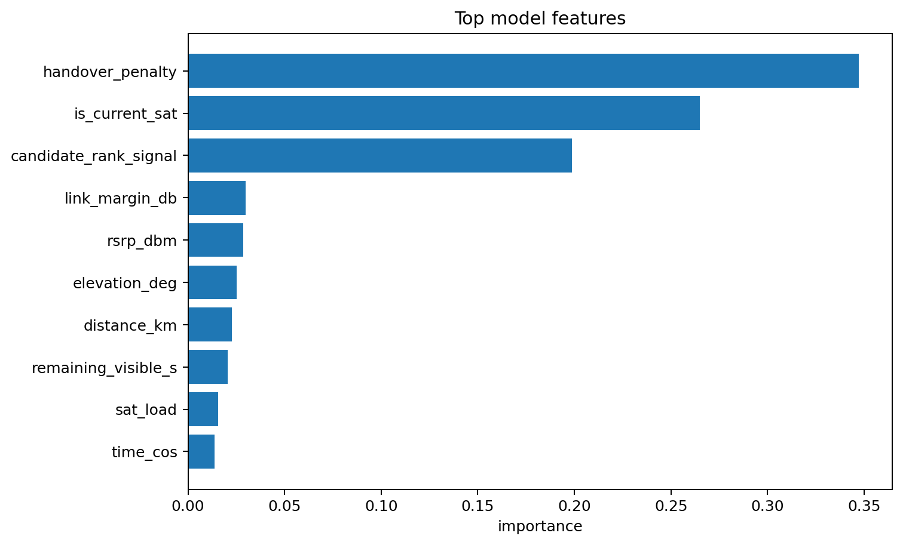

# LEO Satellite Handover AI Optimizer



> ⚠️ **시범용 synthetic data 기반 포트폴리오 프로젝트입니다.** 이 저장소에는 실제 위성 사업자 로그, 고객 데이터, 상용 통신망 telemetry, 실제 산업 적용 결과가 들어있지 않습니다. 모델/API는 실제 LEO 위성망에 배포되었거나 검증된 시스템이 아닙니다.

**LEO 위성 네트워크 환경에서 핸드오버 결정을 최적화하기 위한 AI 기반 프로토타입**입니다. 빠르게 변하는 위성 연결 후보를 단순히 신호 세기만으로 고르지 않고, 남은 가시 시간, 위성 부하, 현재 연결 유지 비용까지 함께 고려해 후보 위성을 ranking합니다.

## 왜 이렇게 만들었는가

처음에는 “현재 신호가 가장 좋은 위성을 고르면 되지 않을까?”라는 baseline에서 시작했습니다. 그런데 LEO 환경에서는 지금 신호가 강해도 곧 시야에서 사라지면 다시 핸드오버가 필요합니다. 그래서 신호 중심 정책과, visibility/load/stability를 함께 보는 정책을 나눠서 같은 기준으로 비교했습니다.

## 프로젝트에서 보여주는 역량

- 공개 가능한 synthetic LEO 후보 링크 시뮬레이터 설계
- elevation, distance, RSRP-like signal, link margin, satellite load, remaining visibility, handover cost 기반 feature engineering
- 투명한 oracle utility를 활용한 supervised label 생성
- 랜덤 split이 아닌 temporal holdout 기반 평가
- `max_signal`, `sticky_signal`, `visibility_guard`, `load_aware`, `stability_aware` baseline 비교
- scikit-learn 기반 AI ranker 학습 및 평가
- FastAPI `/score`, `/explain` endpoint 구성
- Pytest, GitHub Actions 기반 테스트 구조
- GitHub Pages용 `index.html` 포트폴리오 페이지 구성

## 시스템 구조



각 decision epoch에서 사용자 단말이 볼 수 있는 위성 후보들을 테이블로 만들고, 그중 하나를 oracle-selected satellite로 라벨링합니다. AI 모델은 같은 epoch 안의 후보 위성들을 점수화해 최적 후보를 선택합니다.

## 재현 가능한 예시 결과

아래 결과는 포함된 synthetic simulator와 temporal holdout split으로 생성한 예시입니다. 실제 상용망 성능 주장이라기보다, 모델/실험 파이프라인이 정상 동작하는지 보여주는 smoke-test benchmark입니다.

| 정책 | Oracle top-1 일치율 | Handover rate | 평균 remaining visibility | Outage-risk proxy | Oracle regret |
|---|---:|---:|---:|---:|---:|
| max_signal | 0.941 | 0.089 | 259.2s | 0.153 | 0.077 |
| sticky_signal | 0.932 | 0.089 | 257.8s | 0.153 | 0.088 |
| visibility_guard | 0.958 | 0.089 | 265.3s | 0.140 | 0.056 |
| load_aware | 0.962 | 0.089 | 262.6s | 0.153 | 0.029 |
| stability_aware | 0.962 | 0.089 | 265.0s | 0.144 | 0.022 |
| ai_ranker | 0.962 | 0.089 | 263.0s | 0.148 | 0.036 |









## 빠른 실행

```bash
python -m venv .venv
source .venv/bin/activate  # Windows: .venv\Scripts\activate
pip install -r requirements.txt

export PYTHONPATH=src
python scripts/01_generate_dataset.py --output data/leo_candidates.csv
python scripts/02_train_model.py --input data/leo_candidates.csv --model artifacts/handover_model.joblib
python scripts/03_evaluate_policy.py --input data/leo_candidates.csv --model artifacts/handover_model.joblib --output artifacts/evaluation_metrics.json
python scripts/05_explain_epoch.py --input data/leo_candidates.csv --model artifacts/handover_model.joblib --output artifacts/epoch_explanation.json
python -m pytest -q
```

전체 파이프라인 실행:

```bash
PYTHONPATH=src bash scripts/run_full_pipeline.sh
```

## API 데모

모델 학습 후 실행합니다.

```bash
PYTHONPATH=src uvicorn leo_handover.api:app --reload
```

샘플 scoring 요청:

```bash
curl -X POST http://127.0.0.1:8000/score \
  -H "Content-Type: application/json" \
  --data @demo/demo_request.json
```

선택 이유 확인:

```bash
curl -X POST http://127.0.0.1:8000/explain \
  -H "Content-Type: application/json" \
  --data @demo/demo_request.json
```

아직 model artifact가 없으면 API는 fallback load-aware scoring rule을 사용합니다. API 응답에도 synthetic data 경고 문구를 포함했습니다.

## 폴더 구조

```text
.
├── README.md
├── README_KO.md
├── DISCLAIMER.md
├── DATA_NOTICE.md
├── index.html
├── src/leo_handover/          # simulator, features, model, evaluation, API, explanation
├── scripts/                   # 재현 가능한 pipeline scripts
├── tests/                     # pytest smoke tests
├── demo/                      # API request 및 후보 링크 샘플
├── docs/                      # 포트폴리오 문서, run report, data card, 시각 자료
├── data/.gitkeep              # 생성 CSV는 gitignore 처리
└── artifacts/.gitkeep         # 생성 모델 artifact는 gitignore 처리
```

## 핵심 아이디어

```text
score(candidate satellite) = f(signal, geometry, remaining visibility, load, handover cost)
```

투명한 oracle utility로 라벨을 만들기 때문에, 모델이 어떤 feature를 근거로 후보를 선택했는지 설명하기 쉽습니다. 단, 이 oracle은 실제 운영 정답이 아니라 공개용 실험을 위한 기준입니다.

## 데이터 정책과 한계

자세한 경고와 한계는 [DISCLAIMER.md](DISCLAIMER.md), [DATA_NOTICE.md](DATA_NOTICE.md), [docs/DATA_CARD.md](docs/DATA_CARD.md), [docs/BUILD_NOTES_KO.md](docs/BUILD_NOTES_KO.md), [docs/PRODUCTION_GAP_KO.md](docs/PRODUCTION_GAP_KO.md)를 참고하면 됩니다.

실제 산업 적용을 위해서는 TLE/SGP4 기반 궤도 계산, 실제 link budget, beam/gateway constraint, traffic trace, fail-safe policy, latency budget, 실시간 모니터링, 운영 데이터 기반 검증이 추가되어야 합니다.
